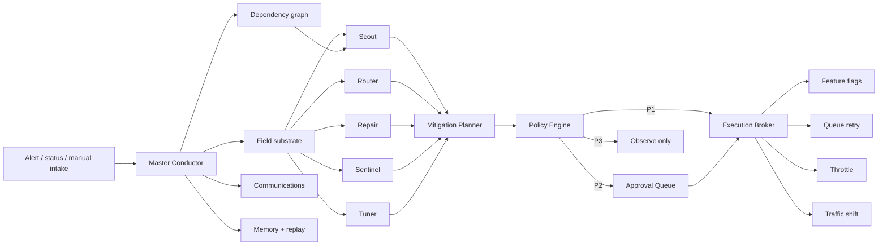

# Architecture

## Prototype substitutions

| PRD production component | v1.0 implementation | Upgrade boundary |
|---|---|---|
| OpenClaw runtime | Deterministic Python conductor plus OpenClaw workspace/skill bridge | Replace role methods with Gateway-routed agents |
| Redis field store | In-process field snapshot aggregate | `FieldSubstrate` interface |
| Postgres | SQLite JSON aggregate store | `MissionRepository` interface |
| NATS/Kafka | In-process ordered mission events | Emit repository events to durable bus |
| Ray workers | Synchronous specialized worker ensemble | Put each worker behind a Ray task/actor |
| OPA | Local policy evaluator with OPA-compatible decision boundary | Replace `PolicyEngine.evaluate` |
| Production APIs | Dry-run adapters and control-state simulator | Replace individual adapters only |

The substitutions minimize setup and failure modes without collapsing the architectural boundaries that matter for validation.
