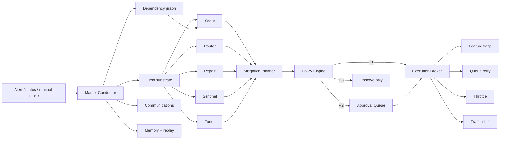

# Hybrid Agentic Swarm (HAS) Reference Architecture v1

HAS architecture v1 uses OpenClaw as the deterministic control plane and Swarm Intelligence models as the decentralized adaptation plane. The key design move is to separate “governed intent” from “emergent navigation”:
•	OpenClaw owns identity, planning, task decomposition, tool invocation, memory, sessioning, and execution boundaries. OpenClaw natively gives each agent its own workspace, state directory, auth profile store, and session store; tools and skills can be scoped per agent; and sandbox/tool policy can be configured per agent.
•	The swarm substrate owns stigmergic coordination: virtual pheromones, local field signals, reward shaping, and decentralized adaptation.
•	A policy/guardrail plane sits above both. That matters because OpenClaw is powerful but not a complete enterprise RBAC platform today; its own docs emphasize prompt-injection, indirect-injection, tool abuse, and identity risk, and there is an open issue indicating native multi-user permission management is not yet fully there.

## Prototype substitutions

| Production component | v1.0 implementation | Upgrade boundary |
|---|---|---|
| OpenClaw runtime | Deterministic Python conductor plus OpenClaw workspace/skill bridge | Replace role methods with Gateway-routed agents |
| Redis field store | In-process field snapshot aggregate | `FieldSubstrate` interface |
| Postgres | SQLite JSON aggregate store | `MissionRepository` interface |
| NATS/Kafka | In-process ordered mission events | Emit repository events to durable bus |
| Ray workers | Synchronous specialized worker ensemble | Put each worker behind a Ray task/actor |
| OPA | Local policy evaluator with OPA-compatible decision boundary | Replace `PolicyEngine.evaluate` |
| Production APIs | Dry-run adapters and control-state simulator | Replace individual adapters only |

The substitutions minimize setup and failure modes without collapsing the architectural boundaries that matter for validation.
